# LINZ Redistricting Plugin - User Interface Design

- [About](#about)
- [Links](#links)
- [UI Components](#ui-components)
    + [Redistricting Toolbar](#redistricting-toolbar)
    + [Map View](#map-view)
    + [Redistricting Dock](#redistricting-dock)
    + [Redistricting Dock Options Toolbar](#redistricting-dock-options-toolbar)
- [Redistricting toolbar](#redistricting-toolbar)
  * [Redistricting tools (B1, B5, F1)](#redistricting-tools-b1-b5-f1)
    + [Interactive Redistricting Tool](#interactive-redistricting-tool)
    + [Redistrict Selected Meshblocks](#redistrict-selected-meshblocks)
  * [Electorate Statistics Tool](#electorate-statistics-tool)
  * [Map Themes Switcher (B5, F5)](#map-themes-switcher-b5-f5)
    + [Population Display in Map Themes (B8, F4)](#population-display-in-map-themes-b8-f4)
  * [New Themed Map View (B5, F2, F5)](#new-themed-map-view-b5-f2-f5)
- [Layer Control and Legend](#layer-control-and-legend)
- [Redistricting Dock](#redistricting-dock-1)
  * [Statistics Display](#statistics-display)
    + [Electorate Summary](#electorate-summary)
    + [Interaction with Statistics NZ](#interaction-with-statistics-nz)
- [Redistricting Dock Options Toolbar](#redistricting-dock-options-toolbar-1)
  * [Scenario Control (B2)](#scenario-control-b2)
    + [Switch to Existing Scenario](#switch-to-existing-scenario)
    + [Branch to New Scenario](#branch-to-new-scenario)
    + [Import Scenario from Database (B15)](#import-scenario-from-database-b15)
  * [Validate Districts (F14)](#validate-districts-f14)
  * [Plugin Options](#plugin-options)
    + [Create New Electorate (B10)](#create-new-electorate-b10)
    + [Database Menu](#database-menu)
      - [Export Database](#export-database)
      - [Import Master Database](#import-master-database)
    + [Update Meshblock Table (B4, F16)](#update-meshblock-table-b4-f16)
    + [Export Districts](#export-districts)
    + [View Log](#view-log)
  * [Plugin Documentation](#plugin-documentation)

# About

This document details the UI Design for the LINZ Redistricting QGIS Plugin.

## Document Version

- Current: 3.0.0 (2018-04-17)

# Links

- [Plugin requirements](https://github.com/linz/qgis-redistricting-plugin/wiki/Requirements)

# UI Components

When activated, the LINZ Redistricting Plugin will add a number of new components to the QGIS window:

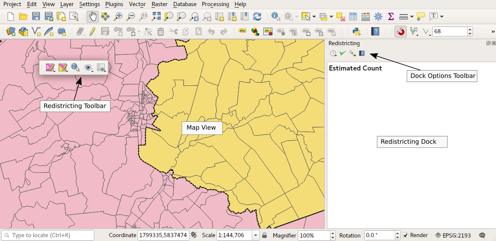

### Redistricting Toolbar

The Redistricting Toolbar is a floating toolbar containing map tools and map theme controls, for use during a redistricting operation. It contains tools which are frequently used while redistricting.

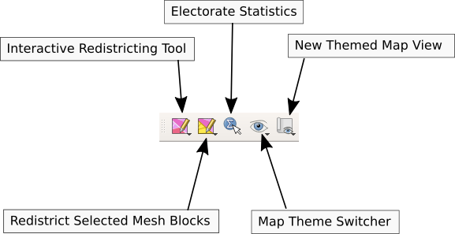

### Map View

The main map view is an interactive display of the current meshblock electorate assignments (F5), and is where interaction with the electorates and meshblocks occurs. The map view can be modified by displaying different map "themes", e.g. to visual electorate changes, non-compliant electorates, etc.

### Redistricting Dock

The Redistricting Dock is initially shown in the right of the window (although it can be freely moved and "undocked" from the main QGIS window, e.g. to allow display on a secondary monitor). It contains a display showing redistricting statistics and other feedback.

### Redistricting Dock Options Toolbar

The Redistricting Dock Options Toolbar is shown at the top of the Redistricting Dock, and it contains actions for the less-frequently used operations for the plugin. 

# Redistricting toolbar

## Redistricting tools (B1, B5, F1)

The plugin will expose two map tools for performing redistricting operations. Both tools will be available through the floating redistricting toolbar:

Both redistricting tools operate on the electorate type selected using the [Task Switcher](#task_switcher) control.

### Interactive Redistricting Tool

The Interactive Redistricting Tool allows for instant feedback about the changes in population totals which will result from a potential redistricting operation. It is a live tool and requires no existing selection within a layer to operate. It is designed to allow possible redistricting operations to be tested before "locking in" these changes.

The tool is ONLY active when the meshblock layer is in edit mode, and changes made by the tool are pushed to into the undo buffer. All operations can be undone and redone up until the changes are committed to the layer (refs F11).

The Interactive Redistricting Tool operates on the electorate type selected using the [Task Switcher](#task_switcher) control - e.g. if the current task is set to Maori electorates, then the redistricting tool will alter the meshblocks assigned Maori electorate.

When the tool is activated, the mouse cursor will change to a snapping tool, which snaps to current electorate boundaries for the selected electorate type. The cursor will only snap to boundaries between multiple electorates (so single electorate boundaries, for example coastal boundaries, are not clickable).

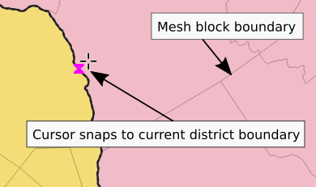

When activated, the tool can be used to either click on one of these current electorate boundaries, or within the area defined by a current electorate itself:

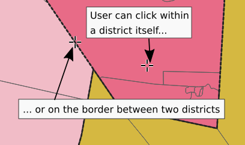

When a electorate or electorate boundary is clicked, an overlay appears over the map which displays the current population of the electorates. For performance, these population totals will be based off the estimated offline populations and will not trigger a population request from the Statistics NZ API. 

As the mouse is moved over adjoining meshblocks, these meshblocks are temporarily re-assigned to a new electorate. The logic used to assign the new meshblock is:

- If the operation was triggered by clicking a single electorate, then the meshblocks will be assigned to the clicked electorate:

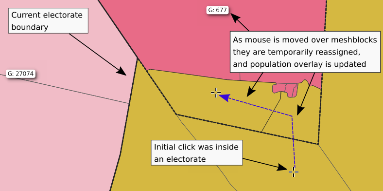

- If the operation was triggered by clicking a border between two electorates, then the meshblocks will be assigned based on the direction of the cursor movement:

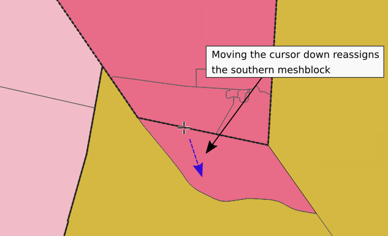

As the cursor is moved over meshblocks and they are temporarily re-assigned, the map overlay with estimated population counts is immediately updated, showing the new estimated populations of the affected electorates (refs B8).

The tool operates in the standard "click-click" mode utilised by map tools within QGIS 3.0, where the first left mouse click starts the editing operation for the tool, and a second left-mouse click is required to "lock in" the changes. Clicking the right mouse button, or pressing the ESC key, cancels the operation without making any changes. A left-click will 'accept' this change (pushing the new electorate assignments into the layer edit buffer).

If any of the affected electorates had population counts and projected populations obtained from Statistics NZ stored within the local redistricting database, these counts will be cleared and only the estimated offline populations will be available for these districts until an updated population count is requested (see [Interaction with Statistics NZ](#interaction-with-statistics-nz)).

All user redistricting operations are automatically logged (see [View Log](#view-log), refs B12). 

### Redistrict Selected Meshblocks

The Redistrict Selected Meshblock tool is a non-interactive redistricting tool, which operates on the currently selected meshblocks only. It is designed to be used alongside the standard QGIS feature selection tools, such as the Select by Rectangle, Select by Value and Select by Expression tools. This allows users to select affected meshblocks using complex criteria, such as selecting by meshblock attributes or spatial relationships, and then redistrict the selection.

The Redistrict Selected Meshblocks tool will only be enabled when a selection exists in the meshblock layer. Additionally, the tool is ONLY active when the meshblock layer is in edit mode, and changes made by the tool are pushed to into the undo buffer. All operations can be undone and redone up until the changes are committed to the layer (refs F11).

The  Redistrict Selected Meshblocks tool operates on the electorate type selected using the [Task Switcher](#task_switcher) control - e.g. if the current task is set to Maori electorates, then the redistricting tool will alter the meshblocks assigned Maori electorate.

After clicking the action, the user is then given a selection of available electorate districts to reassign the selection to. The dialog lists all available electorates, and includes a search widget for filtering the list. Electorates with NO assigned meshblocks appear at the top of the list for quick access. A list of the most recently used electorates is shown at the top of the dialog for quick access, and the dialog defaults to selecting the **most recently** used electorate.

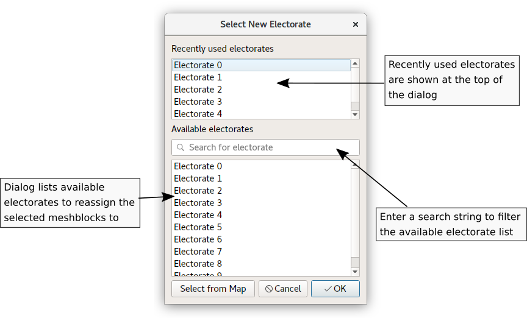

Additionally, the dialog includes an option to `Select from Map`. If this option is clicked, the dialog will close and the map mouse cursor will change to a "electorate picking" tool, allowing the user to click an electorate within the map. After a click is made in this mode, the user is presented with a confirmation dialog before the new district is locked in.

Closing the electorate dialog without accepting a new electorate OR clicking `Select from Map` cancels the operation.

After accepting a new electorate, the new electorate assignment will be pushed into the layer's edit buffer. The changes can be undone and redone until they are committed to the layer permanently.

If any of the affected electorates had population counts and projected populations obtained from Statistics NZ stored within the local redistricting database, these counts will be cleared and only the estimated offline populations will be available for these districts until an updated population count is requested (see [Interaction with Statistics NZ](#interaction-with-statistics-nz)).

All user redistricting operations are automatically logged (see [View Log](#view-log), refs B12). 

## Electorate Statistics Tool

The Electorate Statistics Tool is an interactive map tool available via the Redistricting Toolbar. 

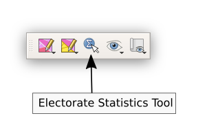

When activated, the tool allows the user to click within a electorate or meshblock within the map. After a click occurs, the statistics for the clicked electorate districts are shown within the Redistricting Dock. More details about the dock functions and display are included in the [Redistricting Dock](#redistricting-dock-1) section.

## Map Themes Switcher (B5, F5)

The Map Themes Switcher is available via the Redistricting Toolbar.

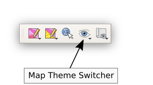

The Theme Switcher allows users to control the appearance of the main Map View, for example to switch between showing the current electoral districts or changes from past electoral districts (refs B6). When the switcher is clicked, a drop down menu will appear showing all available map themes:

Clicking one of the available themes will change the map display in the main window to match the selected theme.

### Population Display in Map Themes (B8, F4)

When either `Electorate` or `Invalid Districts` themes are selected, the map view will show labels over electorates indicating the electorate population.

The label will take the general format of (note: exact format may be subject to change):

- Population count. If an accurate Statistics NZ population is already available for the electorate, it will be shown (see [Interaction with Statistics NZ](#interaction-with-statistics-nz)). If no Statistics NZ population is available, instead the population based on the inaccurate offline meshblock populations will be shown (refs B14). This will be indicated by a `*` suffix shown after the population (e.g. `56786*` for an inaccurate offline population, `58775` for an official Statistics NZ population count)
- Quota and variance. The quota, and variance from the quota will also be shown, e.g. `Q: 57000, -2%`

## New Themed Map View (B5, F2, F5)

The next action available in the Redistricting Toolbar is the New Themed Map View action.

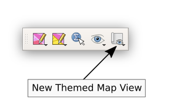

Like the Map Theme Switcher, this option allows users to visualise the electorate districts via different map themes. Clicking the button shows the same options as are available through the Map Theme Switcher, but selecting any of these options opens a brand new map window showing the selected theme:

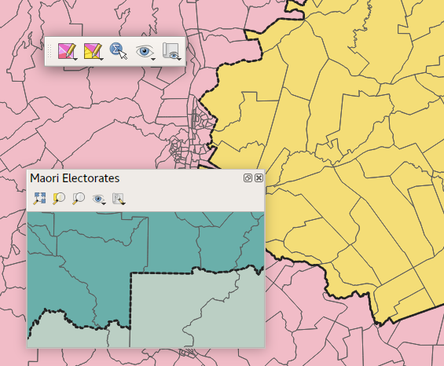

This window is independent from the main map view and can show a different theme (for example, current electorates vs changed electorates shown in the main view). Additionally, the window can be freely moved or placed anywhere in the QGIS interface, or dragged outside of the window and placed on a secondary monitor.

There is no limit on the number of combination of new map views which can be created by users. New map views created in QGIS can also have independent extent and zoom from the main window, or optionally they can be set to "synchronize" their view and scale with the main map view.

## Task Switcher

The final action available in the Redistricting Toolbar is the Task Switcher action.

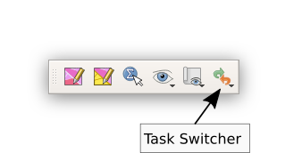

The `Task Switcher` allows the user to select which electorate type (General North Island, General South Island, or Maori) they are currently working with. Clicking the action shows a drop-down menu giving a choice of electorate types:

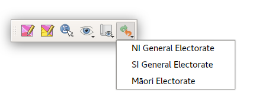

When the user selects a new electorate type from the task switcher, all UI actions operate on that electorate type. For instance, redistricting tools will apply the current electorate type to the meshblocks, and the map theme views will show the current electorate type. 

# Layer Control and Legend

The standard QGIS layer control and map legend will be shown by the application. This allows users to interact with the map display, including switching on and off map layers (refs F7), and adding other contextual layers as required (refs F9). Additionally, the layer control includes an embedded map legend allowing identification of symbology used within the map view (refs F8). 

# Redistricting Dock

The `Redistricting Dock` contains a display showing redistricting statistics and other user feedback. It is normally shown docked on the right side of the application window, but can be freely moved and 'undocked', e.g. to allow placement on a secondary monitor if desired.

## Statistics Display

The dock is used most commonly alongside the [Electorate Statistics Tool](#electorate-statistics-tool) to display the population statistics about a selected electorate.

### Electorate Summary

After the tool is used to click within an electorate, the dock will display a summary of statistics relating to that electorate:

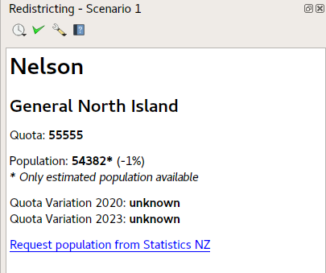

These statistics include the current electorate, electorate type and the electorate population quota. Initially, only the offline population estimate (based on the inaccurate offline meshblock population counts) is shown in the dock (see image above) (refs B14). This is displayed alongside the variation from the population quota for the electorate. If the quota variation exceeds the +/-5% tolerance a warning will be shown:

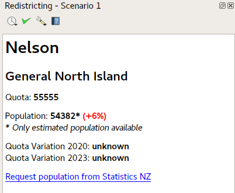

### Interaction with Statistics NZ

The dock statistics window includes a link to request the population counts from Statistics NZ, using the secure API. Clicking this link will trigger a request to the Statistics NZ for accurate population counts (refs F3). The request occurs in the background, without blocking interaction with the application. Whilst the request is occurring, the population counts will temporarily show an 'updating' notice:

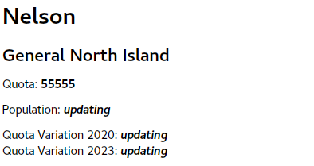

After the request completes, the accurate population count (and its variance from the electorate's quota), and projected variations will be displayed (refs B3):

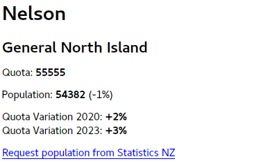

The Statistics NZ populations for the electorate will be stored within the redistricting database and used for population labels on the map (refs F13).

# Redistricting Dock Options Toolbar

The Redistricting Dock Options Toolbar is shown at the top of the Redistricting Dock, and it contains actions for the less-frequently used operations for the plugin.

## Scenario Control (B2)

The scenario control action in the Redistricting Dock Options Toolbar gives users access to commands relating to switching and creating new scenarios.

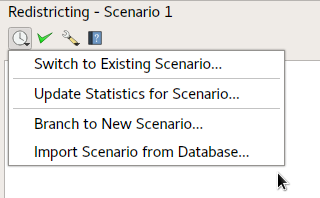

The active scenario is shown in the Redistricting Dock title bar:

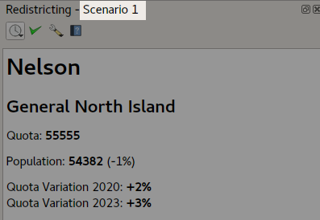

### Switch to Existing Scenario

Selecting the `Switch to Existing Scenario` action opens a dialog showing all available scenarios. It also includes a search widget for filtering the list.

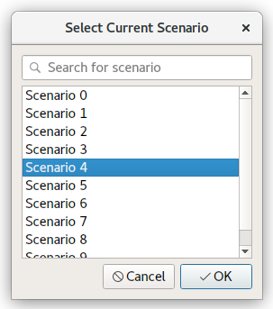

If the user selects a scenario and clicks OK, the selected scenario will be loaded from the database and made the current scenario for the session. The Map View will update accordingly to reflect the district assignments from the selected scenario.

The active scenario is remembered between sessions, so re-launching the redistricting application will cause the last used scenario to become the active scenario.

### Update Statistics for Scenario

The `Update Statistics for Scenario` action can be used to trigger a complete bulk refresh of all existing population statistics for the current electoral district assignments via the Statistics NZ API. This action both refreshes any existing stored population statistics and also fetches any missing population statistics. The update occurs in a background task, allowing users to continue working with the application whilst the updated population counts are fetched.

### Branch to New Scenario

The `Branch to New Scenario` action allows users to create a brand new scenario. On selecting the action, the user will be presented with a dialog prompting them for a unique name for the new scenario:

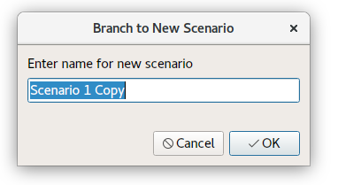

If the user accepts this dialog, then the current scenario will be copied into a new scenario with the specified name. The new scenario will become the active scenario for the session.

### Import Scenario from Database (B15)

The `Import Scenario from Database` action allows copying a scenario from another redistricting database file across to the user's redistricting database. It enables different users to work on different scenarios concurrently, and at a later stage import these scenarios back into the master version of the redistricting database (refs B15).

On selecting the action, the user is prompted with an Open File dialog allowing them to select the redistricting database to import from. When the user selects a file, some checks are performed to ensure that the selected file is a valid redistricting database and that it contains scenarios to import.

The user is then presented with a list of scenarios present in the selected database file:

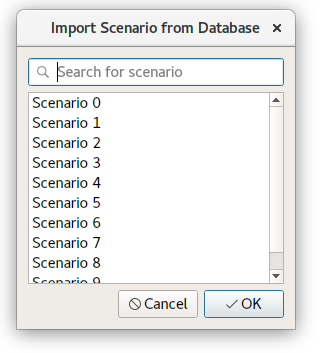

If the user selects a scenario to import, they will then be prompted for a name to use for the newly imported scenario:

Upon accepting this dialog, the scenario will be imported into the user's redistricting database. Unlike the `Branch to New Scenario` action, the user's current scenario will NOT be changed, and the user must manually select `Switch to Existing Scenario` to switch to the newly imported scenario.

_**OPEN QUESTION: How should we treat the log here? Should all logged operations for the selected scenario also be imported?**_

## Validate Districts (F14)

The `Validate Districts` action allows users to run contiguity and sense checks on the current meshblock assignments. The validation occurs in a background task, allowing users to continue working with the application whilst the check is performed. During the validation, accurate population counts will be requested from the Statistics NZ API for any electorates where an accurate population count is not currently available (see [Interaction with Statistics NZ](#interaction-with-statistics-nz)).

Upon completion, the Redistricting Dock display will be updated to show the validation results:

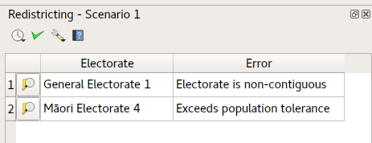

The validation results are shown as a table, displaying any electorates which failed the validation criteria. The electorate name and reason for failure are shown, along with a button to zoom the map view to the electorate.

## Plugin Options

The `Plugin Options` action displays a drop-down menu showing infrequently used application actions.

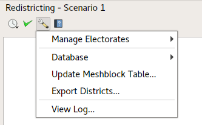

### Manage Electorates

The `Manage Electorates` menu allows for management of electorates, including adding new electorates and deprecating existing electorates.

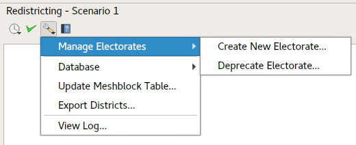

#### Create New Electorate (B10)

The `Create New Electorate` action allows for users to create a new electoral district. After selecting the option, the user is then prompted to enter a name for the new electorate. The electorate type will be set to the current session electorate district type, and this is shown in the title bar of the dialog for clarity:

If a unique name is entered and the dialog accepted, the new electorate will be added to the redistricting database and will be available to assign to meshblocks via the `Redistrict Selected Meshblocks` tool.

#### Deprecate Electorate

The `Deprecate Electorate` action allows users to mark an electorate as 'deprecated'. Deprecating hides the electorate from all electorate selector dialogs, so that meshblocks can no longer be assigned to the deprecated electorate. The electorate remains present in the backend database to maintain integrity of existing scenarios and the user action log. Triggering the action prompts a dialog asking the user which electorate they wish to deprecate:

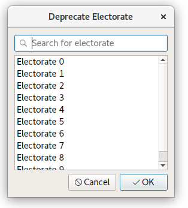

This dialog will show ALL electorates, including those which have already been deprecated. Currently deprecated electorates are marked with an * prefix. Selecting them from the dialog will present the user with the choice of "un-deprecating" the electorate.

If the user selects an electorate which currently has meshblocks assigned to it, they will be presented with an error message showing the assigned meshblocks, and the deprecation will not be permitted.

### Database Menu

The `Database` menu contains actions relating to the redistricting database:

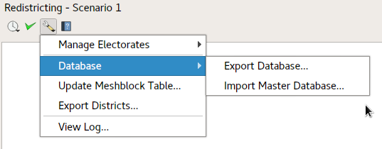

#### Export Database

The `Export Database` action allows users to export their current redistricting database to a file. This exported database can then be used to import scenarios on another workstation (see [Import Scenario from Database (B15)](#import-scenario-from-database-b15)), or to replace user's redistricting databases with this new 'master' database copy.

Selecting `Export Database` gives the user a file save dialog allowing them to choose a filename for the exported database. 
Upon selecting a filename the database export occurs in a background task, allowing users to continue interacting with the application while the export completes.

The `Export Database` action can also be used to make a backup copy of current redistricting database. (Complete backup handling and storage is not a function of the application and is left to the application operators to perform).

#### Import Master Database

The `Import Master Database` action is used to completely replace the user's current redistricting database with a stored version. Upon selecting the action the user will be prompted to select the master database file. They will then be shown a warning dialog explaining the consequences of this action, and must enter the string 'I ACCEPT' in order to proceed with the import:

Before the master database is imported, the user is asked to select a location for a full backup of the current database. This is performed before importing the new master database for security.

### Update Meshblock Table (B4, F16)

Triggering the `Update Meshblock Table` will prompt the user to select a new meshblock table to import. Importing a new meshblock table causes the following operations to occur:

- All existing meshblocks are copied to a archive table within the redistricting database (alongside their unique meshblock version id)
- A new unique version id is created for the new meshblock table.
- The master meshblocks table in the redistricting database will be updated to reflect the new meshblocks
- Electorate boundaries will be recalculated based on the new meshblocks, and ALL stored populations obtained from the Statistics NZ API will be cleared.
- Logging operations will be stored using the new meshblock version id (see [View Log](#view-log)).

A new table view is opened showing just the meshblocks which have been changed since the previous version of the meshblock table (including meshblocks which have been removed). This allows users to step through this table and move the map view to see the affected meshblocks and how the change has impacted the districting operations.

### Export Districts

The `Export Districts` action will allow users to create a dissolved copy of the current electorate districts (refs F6, F15). Selecting this action will trigger a file save dialog prompting the user to select a file location for the exported districts.

Upon acceptance, the application will spatially dissolve both the General Electorates and Maori Electorates. A geopackage database will be created containing spatial tables of these electorates, and a separate table detailing districts assigned to each meshblock. Additionally the user event log will also be included as a non-spatial table (see [View Log](#view-log)).

The mesh block to electorate assignments will be exported in a table of the format:

Meshblock | NI General | SI General | Maori
-----------------------------------------------------------
MB1 | electorate 1 |  | electorate 2
MB2 | electorate 3 |  | electorate 5

The export process will occur in a background task to allow users to continue using the application while the export is performed.

### View Log

The `View Log` action opens a dialog showing a user interaction log window (refs B12, F15). The log will show:

- The scenario the operation applies to
- Date/Time of the change
- Name of the user performing the operation (obtained automatically from current user logon name)
- What change was made i.e. From and To electorates
- The unique version ID of the meshblock table the change was applied to (see [Update Meshblock Table](#update-meshblock-table-b4-f16))

## Plugin Documentation

The `Plugin Documentation` action opens the application's User Documentation in a web browser window (refs B7).

